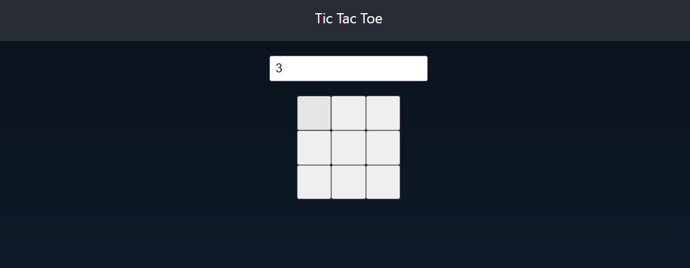

# Tic-Tac-Toe

We have given a input field you can change and create the matrix of n\*n value enter in the input field(n value enter in the field).
The winner combination we are generating dynamically value entered in the input field.

We have written a method inside utils `generateTicTacToeWinnerComb` method for generating the combination of winner.

After the game is over you can see the replay also on clicking of next and previous button.

This project was bootstrapped with [Create React App](https://github.com/facebook/create-react-app).

## Available Scripts

In the project directory, you can run:

### `npm start`

Runs the app in the development mode.\
Open [http://localhost:3000](http://localhost:3000) to view it in your browser.

The page will reload when you make changes.\
You may also see any lint errors in the console.

### `npm run build`

Builds the app for production to the `build` folder.\
It correctly bundles React in production mode and optimizes the build for the best performance.

The build is minified and the filenames include the hashes.\
Your app is ready to be deployed!

See the section about [deployment](https://facebook.github.io/create-react-app/docs/deployment) for more information.
